# Simple Distributed Purchase System

A distributed purchase processing system designed to handle high-traffic purchase attempts safely and consistently using Redis, queues, and worker-based persistence.

This project demonstrates concurrency control, event-driven processing, and stress testing in a simplified single-product purchase scenario.

# Overview

The system simulates a limited-stock purchase event where many users attempt to buy a single product at the same time.

Key guarantees:

* One purchase per user
* No overselling
* Stable API under load
* Reliable persistence via worker processing

# Architecture



[Live Design](https://mermaid.ai/play?utm_source=mermaid_live_editor&utm_medium=share#pako:eNpVj8tuwjAQRX9llFVYwAewqIQbS6VFkDigLGwWeUwhEGzqh1qJ8O84Lgixm7lzpXPmEtWqwWgafXfqt96X2sKCCSmkcdVOl-c9vHctSitkQQlf4p-dHAwUWG2FRNm8NElZH0M2S-e-auxnDn70TUaTec5jhk1rRn7PNnRDeUxc10Hm0OEQFiv2RRlfeh8olD6i9mFCeJwqY3ca82wxelK9DozHb_3Hep32AyZgQzSz6tTWcHbaP2Swh4B_3lH-DEw4qKqHoHI3Gq7wr_HQCVFChIyuN2OwZQo)

# System Components

### apps/web

Next.js frontend for interacting with the purchase API.

Responsibilities:

* Display product information
* Show sale status
* Trigger purchase attempts

### apps/api

NestJS API that acts as the admission layer.

Responsibilities:

* Validate sale window
* Execute Redis atomic purchase logic
* Enqueue purchase jobs

### apps/worker

Node.js worker that processes purchase jobs.

Responsibilities:

* Idempotent purchase handling
* Database writes
* Retry-safe processing

### Redis

Used for atomic concurrency control:

* Stock tracking
* One-purchase-per-user enforcement

### PostgreSQL

Stores final purchase records. The database acts as the final source of truth.

### Product Configuration

The product is predefined in constants to simplify the system and keep testing deterministic. You can modify the predefined product including **total stock**, **sale start**, **sale end** on:

```
packages/shared/constants.ts
```

Configuration includes:

* general meta
* stock
* sale start time
* sale end time

### Running Project

Start Service

```
docker compose up --build
```

### Access Service

Web:

```
http://localhost:3000
```

API:

```
http://localhost:3001/sale/status (To get flash status)
http://localhost:3001/sale/buy (To run purchase)
http://localhost:3001/sale/stock (To get current stock)
http://localhost:3001/sale/purchase/status (To check whether a user has purchased)
```

### Testing

#### Unit tests

```
bun test
```

#### Stress test

```
docker-compose --profile stresstest up --build

(You can change stresstest kind ex: buy, flashsale, big-flashsale on docker-compose.yml)
```

#### Integration test

Integration test reset Redis state before execution to ensure repeatability

#### Expected Stress Test Outcome

* Stock never becomes negative
* Duplicate purchases are prevented
* API remains responsive
* Worker processes jobs correctly

Once stock is exhausted:

* responses transition from SUCCESS to SOLD_OUT
* system remains stable

### Design Decisions

#### Redis for concurrency control

Redis is used as the admission layer to enforce stock limits and one-purchase-per-user using atomic operations.

**Why**

* Extremely Fast
* Prevent overselling under high concurrency
* Keeps API response time low

**Trade-off**

* Redis becomes a critical dependency
* Requires persistance config in production

#### Queue + worker persistence

The API enqueues purchase jobs instead of writing directly to the database.

**Why**

* Prevents database bottlenecks during traffic spikes
* Provides retry safety
* Improves system resilience

**Trade-off**

* Eventual consistency between API response and database state
* Slightly more system complexity

#### Idempotent worker design

The worker rechecks purchase constraints before writing to the database.

**Why**

* Protects against duplicate job execution
* Ensures correctness during retries

**Trade-off**

* Additional database checks
* Slightly more logic in worker

#### Stateless API

The API does not store purchase state locally.

**Why**

* Allows horizontal scaling
* Keeps request handling fast

**Trade-off**

* Requires Redis and queue infrastructure

### Future Improvements

- [ ] Redis cluster support
- [ ]  Multiple products
- [ ]  Authentication layer
- [ ]  Observability metrics
- [ ]  Dead-letter queue
